# HiPerf的抓取和展示说明

HiPerf工具是对系统性能数据进行采样记录，并将采样数据保存为文件，进行读取，展示分析。

## HiPerf的抓取

### HiPerf抓取配置参数

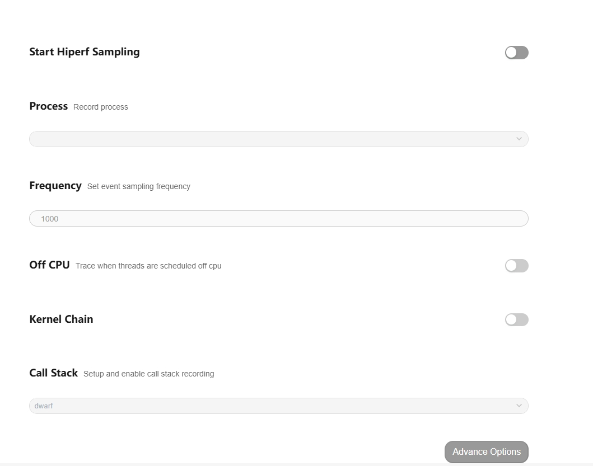
配置项说明：

-     Start Hiperf Sampling：配置项的总开关。
-     Process：离线模式下配置的是整个系统的。
-     Frequency：配置抓取的频率。
-     Call Stack：配置抓取的堆栈类型。
-     Advance Options：更多的抓取配置项。
  再点击Record setting，在output file path输入文件名hiprofiler_data_perf.htrace，拖动滚动条设置buffer size大小是64M，抓取时长是50s。
  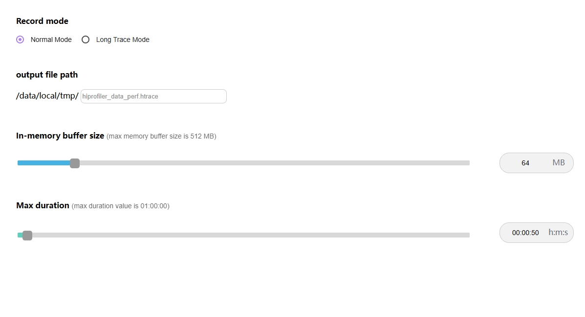
  点击Trace command，就会根据上面的配置生成抓取命令，点击复制按钮，会将命令行复制。
  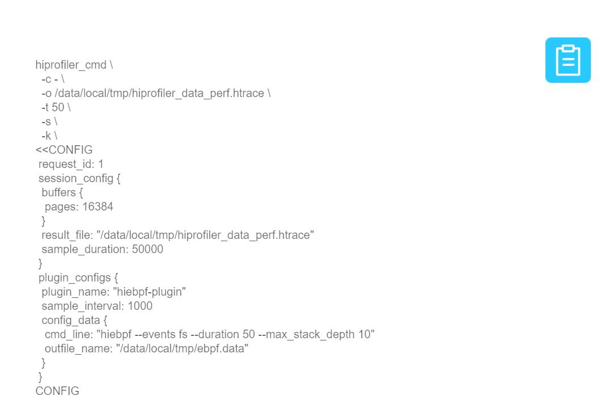
  输入hdc_shell，进入设备，执行命令。
  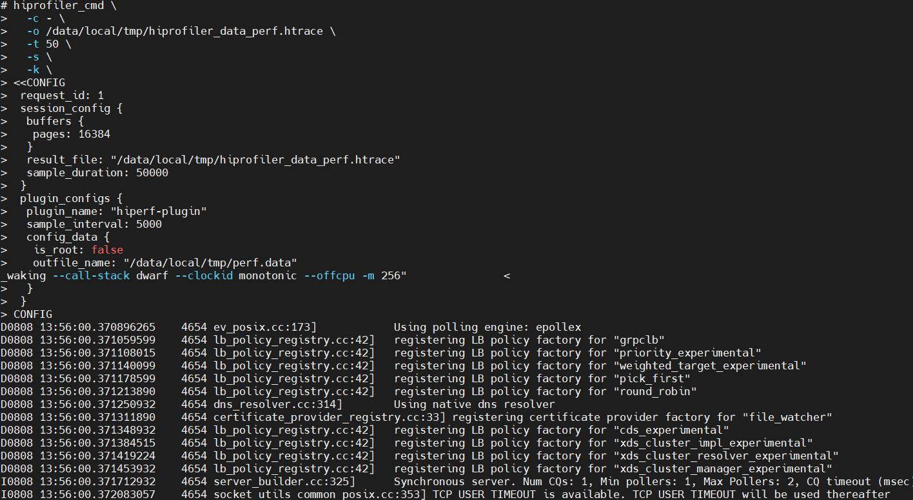
  执行完成后，进入指定目录查看，在/data/local/tmp下就会生成trace文件。
  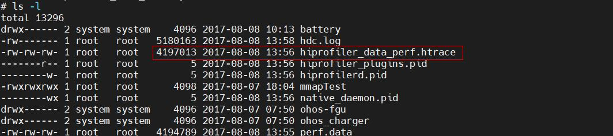

### HiPerf展示说明

将抓取的trace文件导入smartperf界面查看。
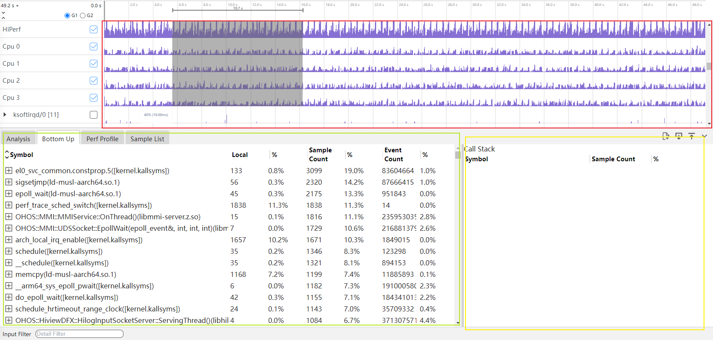

界面布局介绍：Perf整体界面布局分为3个部分：

-     红色区域：泳道图。
-     绿色区域：详细信息(Perf Profile和Sample List)。
-     黄色区域：辅助信息(Callstack)。

### HiPerf泳道图展示

Perf泳道图展示按照CPU使用量和线程和进程展示，鼠标移动到泳道图上，悬浮框会显示CPU的使用量。
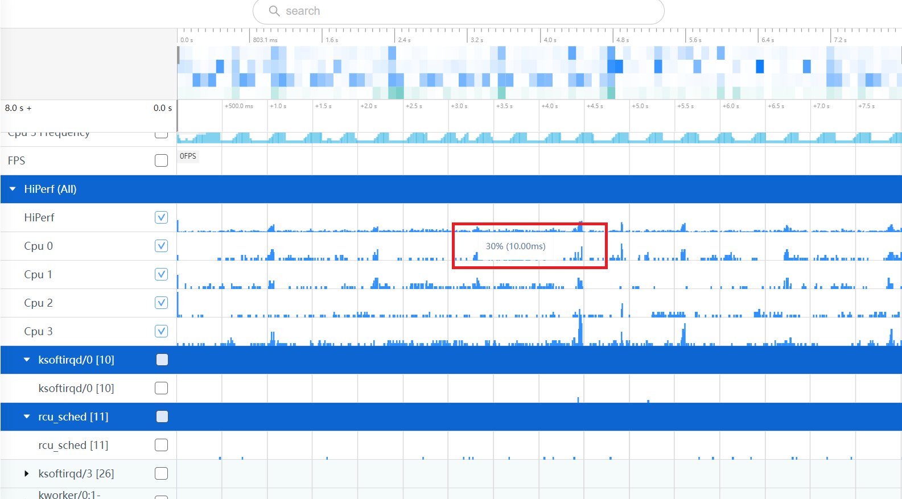
按住w键放大界面，泳道图会出现P的标志，鼠标移动到P图标上，悬浮框会显示每个callstack和调用的深度如下图。
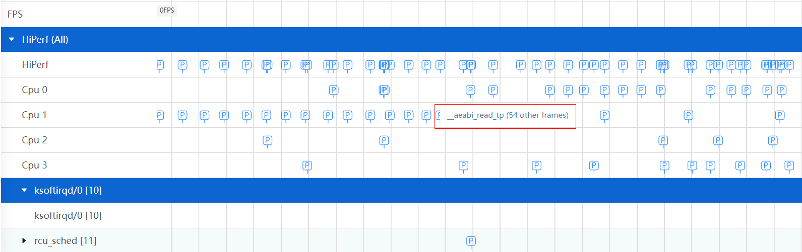
Perf泳道图上浅色表示无效调用栈的采样点，抓取时由于设备上的对应的so无符号信息，函数跟地址都无法获取到，固该采样点在tab页中不做显示。
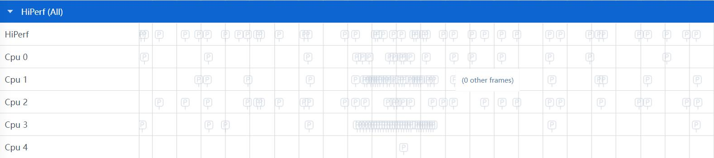

### HiPerf泳道图的框选功能

可以对CPU使用量区，线程和进程区数据进行框选，框选后在最下方的弹出层中会展示框选数据的统计表格，总共有两个tab页。
Perf Profile的Tab页如图：
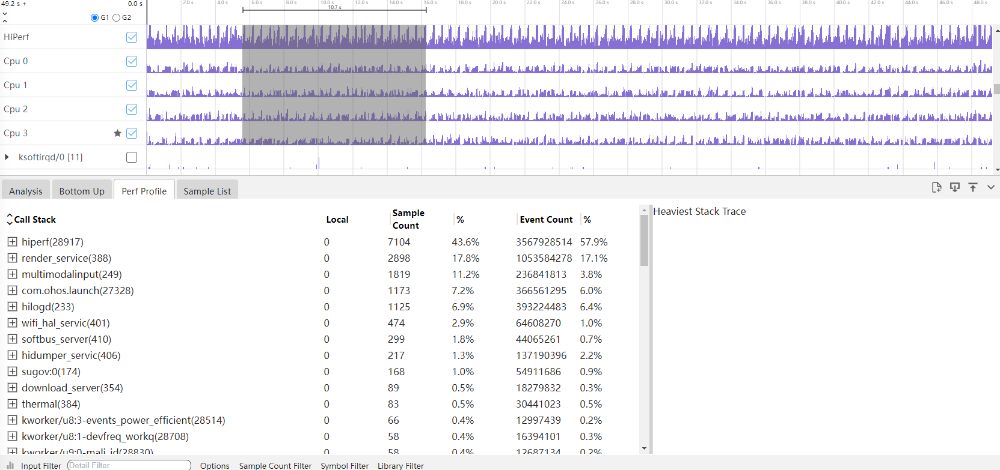

-     Call Stack：为经过符号解析后的Callstack，并且给出动态链接库或者进程名的信息。
-     Local：为该调用方法自身占用的CPU时间。
-     Weight：调用方法的执行次数和占比。
  Sample List的Tab页如图：
  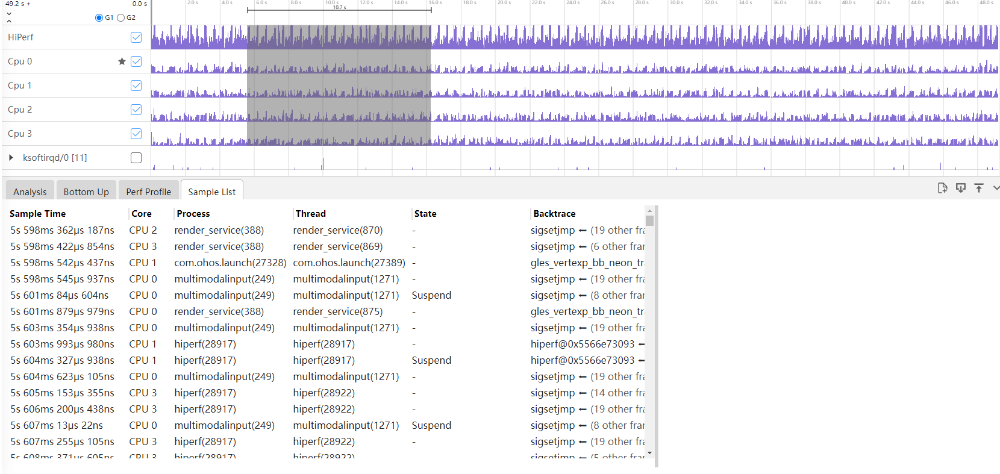
-     Sample Time：采样的时间戳信息。
-     Core：当前的CPU核信息。
-     Process：进程名。
-     Thread：线程名。
-     State：运行状态。
-     Backtrace：栈顶的调用栈名称。

### HiPerf支持多种Options展示风格

点击Perf Profile的Tab页底部的Options，会有两个CheckBox复选框。
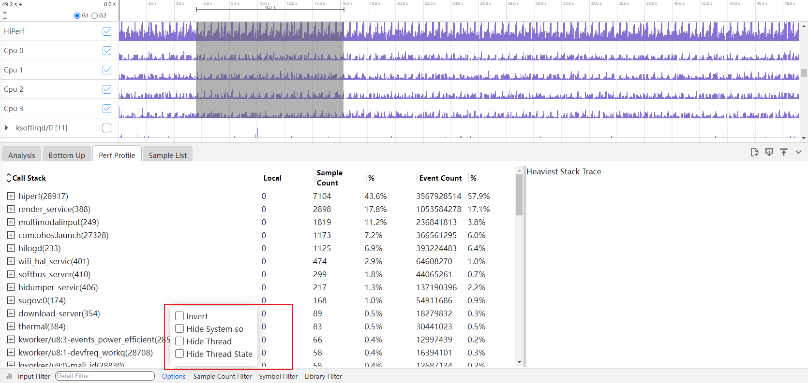

-     Invert：反向输出调用树。
-     Hide System so：隐藏系统库文件。

### HiPerf支持过滤调用栈调用次数的展示风格

点击Perf Profile的Tab页底部的Sample Counter Filter，可以填上区间值。过滤出符合该区间值调用次数的调用栈信息。
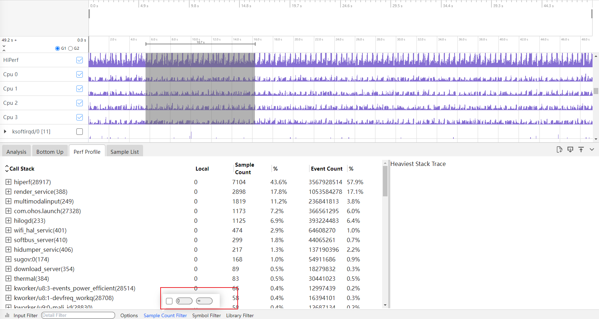

### HiPerf功能的调用栈Group展示-数据分析支持剪裁功能

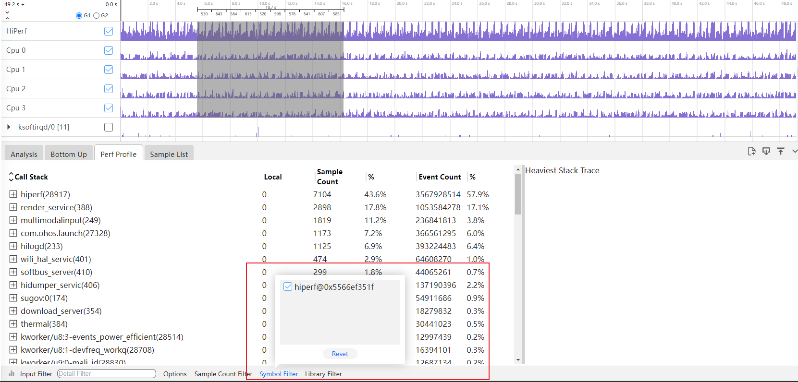

- 裁剪Callstack，点击Callstack上一个节点符号，再点击底部Symbol Filter按钮，则该符号自动被裁剪掉，同时将该节点往下所有的Callstack内容裁剪掉。

- 裁剪Library，点击Library Filter按钮，则该库文件符号下所有的子节点也被裁剪。
- 点击Reset按钮，将恢复选中的裁剪内容。

### HiPerf功能的调用栈Group展示支持按条件过滤

在Input Filter输入关键字，会显示出带有该关键字的展示信息。
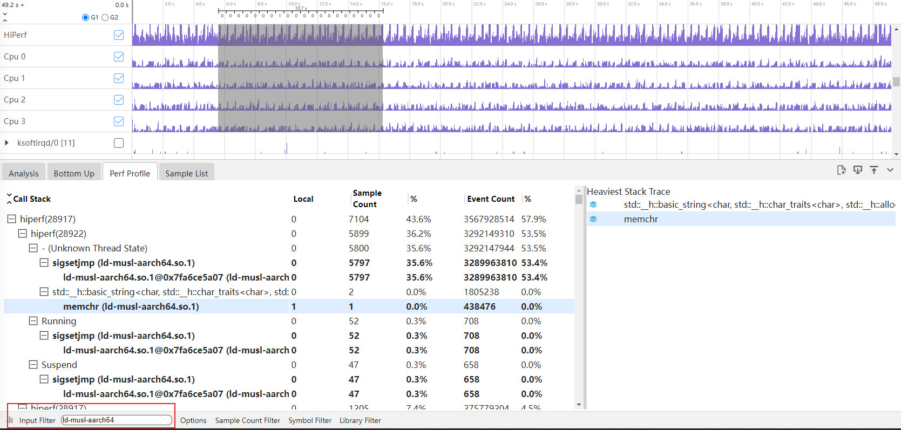

### HiPerf辅助信息区展示调用栈

当在详细信息区选择一个符号时，将展示与该符号相关的完整的调用栈。对上展示到根节点，对下则展示CPU占用率最大的调用栈。调用栈右侧有Sliding bar可以滚动。
如下图的Heaviest Stack Trace：
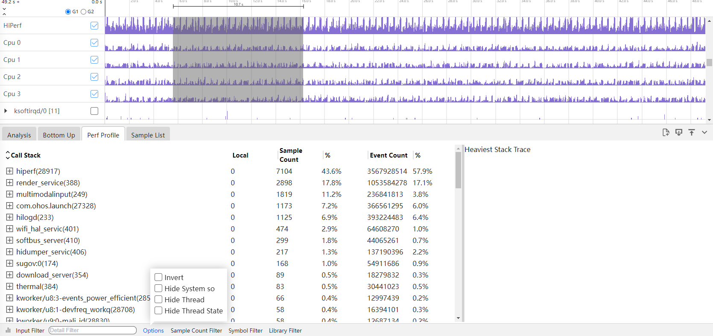

### HiPerf的火焰图功能

点击Perf Profile左下角的柱状图的图标，会切换到火焰图页面。
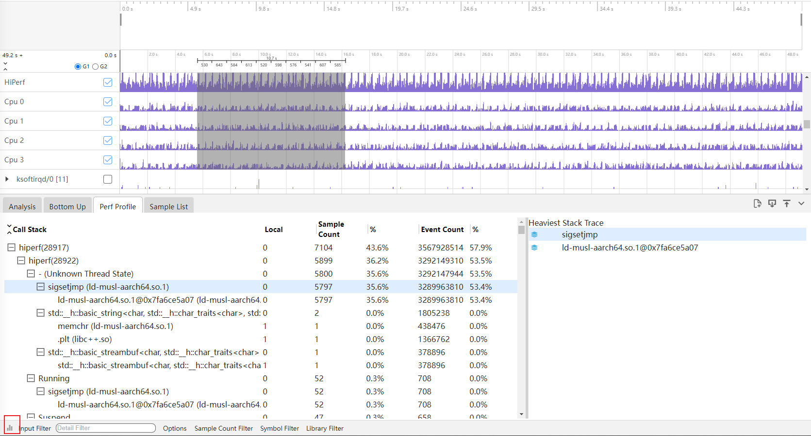
进入到火焰图页面，火焰图的展示跟Callinfo的tab页的调用栈显示一致，鼠标放到色块上，悬浮框可以显示调用栈名称，lib，addr，Count，%in current thread，%in current process，&in all process。
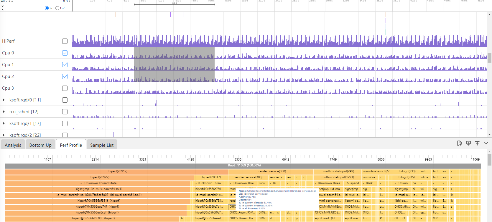

### HiPerf的show event count功能

在Hiperf的父级泳道图上增加筛选功能，可在Cpu Usage 和各种event type之间选择，切换选择之后即可将Hiperf下级各个泳道图数据更新，悬浮框可以根据选择的事件名显示对应的event count。
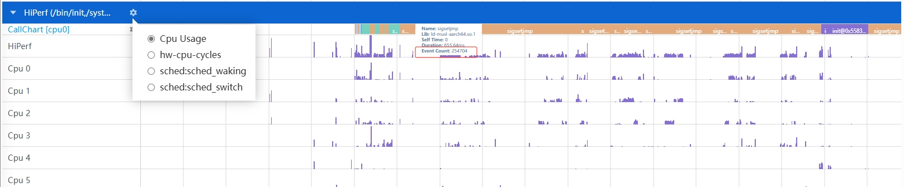

### HiPerf的CPU/进程级/线程级泳道支持时序火焰图， 按照每个时间点的调用栈显示功能

根据Hiperf父级泳道图所筛选的类型，来显示各个CPU或者线程的时序火焰图，用户可根据自己的需要，点击泳道图旁边的齿轮标志筛选出某个cpu 或者线程的火焰时序图数据。
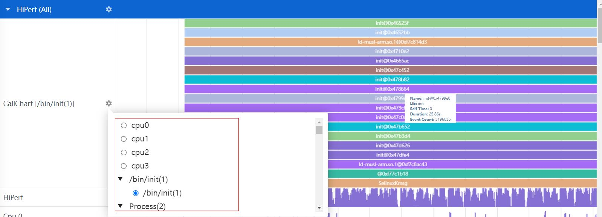

### HiPerf的调用栈分析饼图/火焰图支持按进程、线程粒度可选， 饼图和火焰图可以跳转功能

HiPerf分为process、thread、library、function四层，调用栈均可在每层的表格上鼠标点击右键跳转到对应的火焰图Tab页。火焰图上方标题显示是由哪一层跳转而来，点击关闭图标火焰图重置为当前框选范围的所有数据。
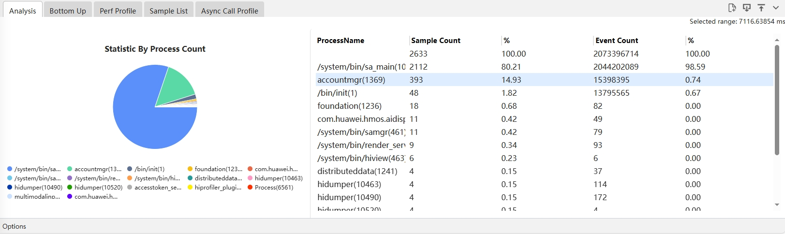
如上图，右键点击hiprofiler_plugins可以跳转到下图
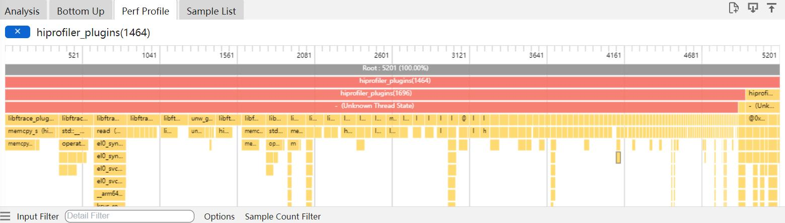
筛选面板新增Hide Thread、Hide Thread State筛选选项，Hiperf可隐藏线程和状态。
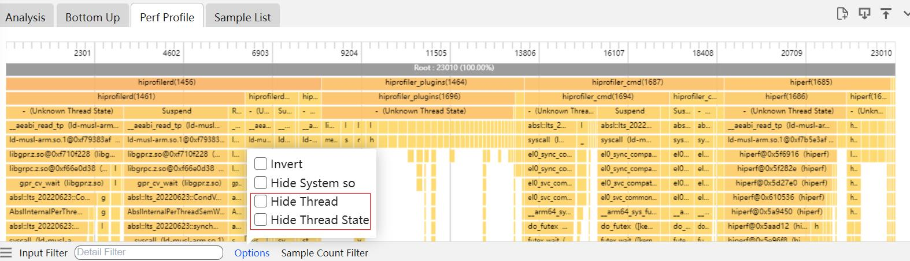
