# Native Memory抓取和展示说明
Native Memory是查看内存的分配和释放等情况。
## Native Memory的抓取
### Native Memory抓取配置参数
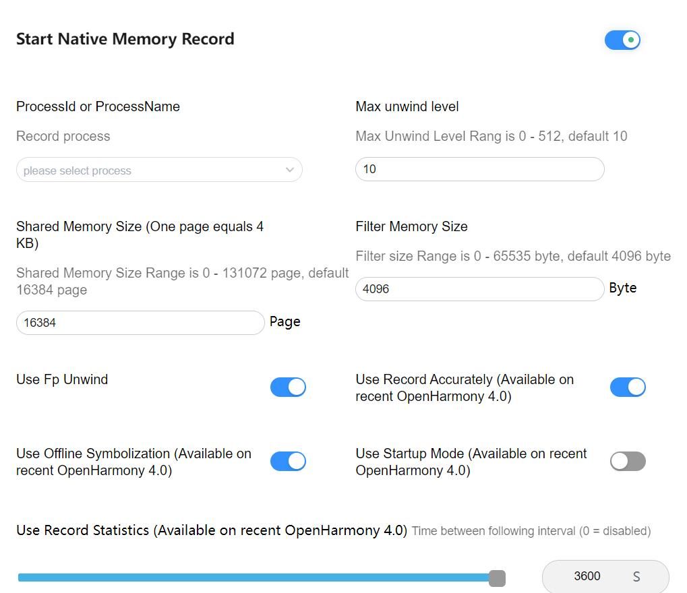
配置参数说明：
* ProcessId or ProcessName：设置抓取的进程ID或者进程名，此处以输入com.ohos.mms进程名为例。
* Max unwind level：抓取的栈的最大深度。
* Shared Memory Size：native_daemon和native_hook进程之间存储数据的共享内存大小。
* Filter Memory Size：只抓取大于该size的malloc数据（free不受影响）。
* Use Fp Unwind：Fp回栈。
* Use Record Accurately：不过滤数据，上报全量的。
* Use Offline Symbolization：离线符号化。
* Use Record Statistics：统计数据上报时间间隔设置。
* Use Startup Mode :抓取应用启动阶段的内存(默认是关闭，需要抓取应用启阶段内存可开启)。

再点击Record setting，在output file path输入文件名hiprofiler_data_nativememory.htrace，拖动滚动条设置buffer size大小是64M，抓取时长是50s。
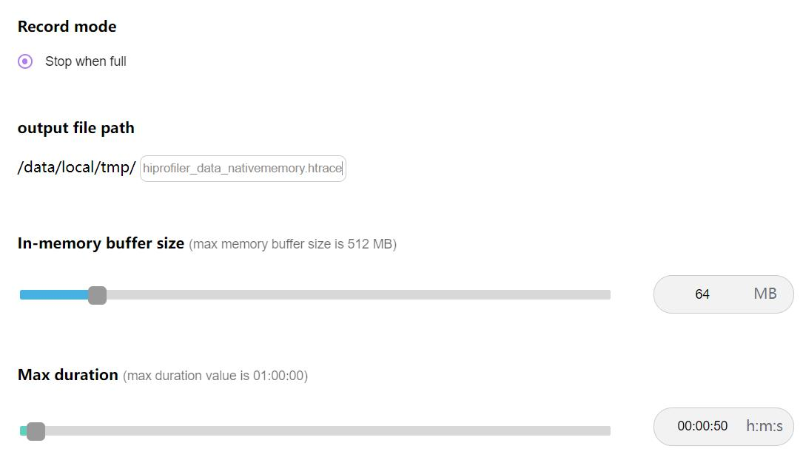

点击Trace command，就会根据上面的配置生成抓取命令，点击复制按钮，会将命令行复制。
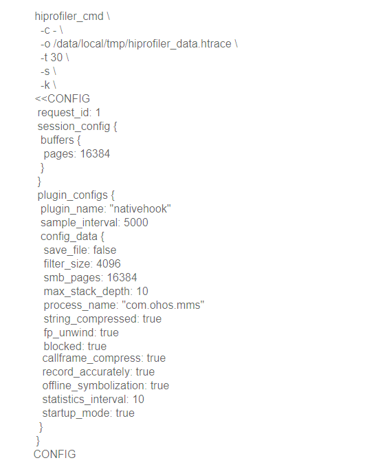

命令行参数说明：
* save_file：是否将hook数据保存成文件，不上报protobuf形式数据给hiprofilerd。
* filter_size：过滤malloc的大小，最小值是0，默认值是4096Byte。
* smb_pages：nativedeamon与libnativehook间的共享内存大小。
* max_stack_depth：最多回栈的层数，也就是抓取的栈的最大深度。
* process_name：抓取的应用进程名。
* string_compressed：是否进行字符串压缩。
* fp_unwind：是否进行fp回栈。
* callframe_compress: 是否进行栈帧压缩。
* record_accurately: 是否不过滤数据，上报全量的。
* offline_symbolization: 是否离线符号化。
* statistics_interval: 统计模式下上报数据的时间间隔。
* startup_mode: 是否需要抓取应用启动阶段内存。

输入hdc_std shell，进入设备，执行命令。
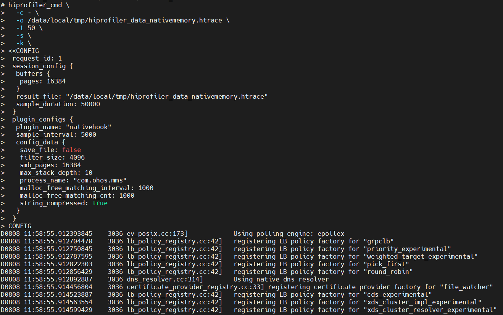
执行完成后，进入指定目录查看，在/data/local/tmp下就会生成trace文件。
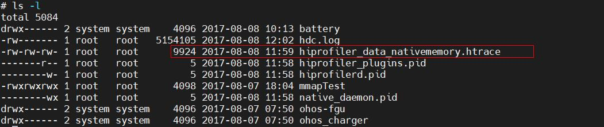
## Native Memory展示说明
将抓取的nativememory文件导入到smartperf工具中查看，查看内存的分配和释放等情况。
### Native Memory泳道图展示类型
点击齿轮状的图标可以设置内存的展示单位。
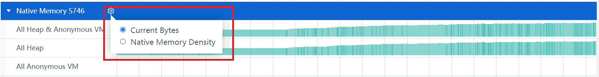
+     Current Bytes：以申请内存的size绘制泳道图。
+     Native Memory Density：以申请内存的数量绘制泳道图。
+     All Heap&AnonuymousVM：malloc分配和mmap分配的总量。
+     All Heap：malloc分配的内存。
+     All Anonymous VM：mmap分配的内存。
### Native Memory泳道图的框选功能
可以对内存的数据进行框选，框选后在最下方的弹出层中会展示框选数据的统计表格，总共有四个tab页。
Statistics的Tab页，主要显示了统计明细类型。
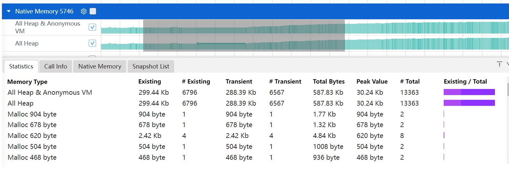
+     Memory Type：内存的类型。
+     Exsiting：框选区域内申请没有释放的大小。
+     #Exsiting：框选区域内申请没有释放的次数。
+     Transient：框选区域内释放的大小。
+     #Transient：框选区域内释放的次数。
+     Total Bytes：框选区间内申请的大小。
+     #Total： 框选区间内申请的次数。
+     Peak Value： 框选区间内内存申请的峰值。
+     Exsiting/Total：框选区间内剩余的内存比上申请的内存，其中浅紫色是框选区间内申请的大小/整个时间轴（申请+释放的总大小)，深紫色是框选区间内(申请+释放)的大小/整个时间轴（申请+释放的总大小）。

Call Info的Tab页，主要显示了调用树详细类型。
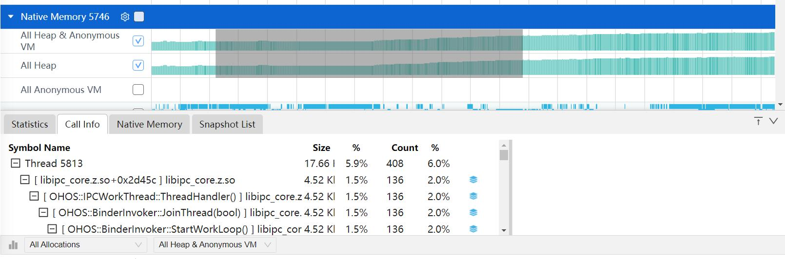
+     Symble Name：每个内存分配的调用栈。
+     Size：分配的总大小。
+     Count：相同调用栈出现的次数。
Native Memory的Tab页，主要显示了单次分配信息列表。
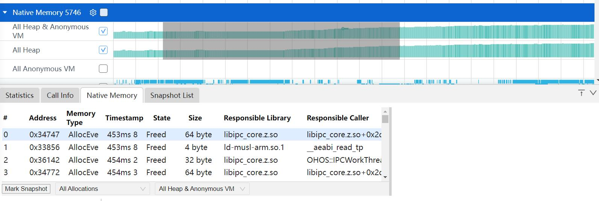
+     Address：内存块的地址。
+     Memory Type：内存分配的类型。
+     Timestamp：时间戳信息。
+     State：内存地址当前状态Existed 表示框选范围内未释放，Freed表示已释放。
+     Size：该次申请分配内存的大小。
+     Responsible Library ：调用该函数的库。
+     Responsible Caller  ：调用该函数的方法。
Snapshot List的Tab页，主要显示了各时刻内存的增长的差值。
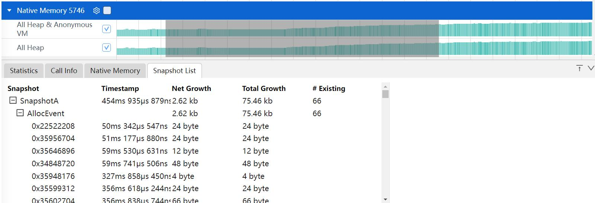
+     Snapshot：标记的打点说明。
+     Timestamp ：时间戳信息。
+     Net Growth ：自从上次Snapshot的增长量，是计算的分配和释放的。
+     Total Growth ：自从上次Snapshot的增长量，是计算的每一次分配的。
+     #Exsiting  ：仍然存在的内存数。
### Native Memory的辅助信息功能
在Call Info和Native Memory的Tab页，点击选中某一行，右边画红线处会显示出该行调用栈的树结构信息。
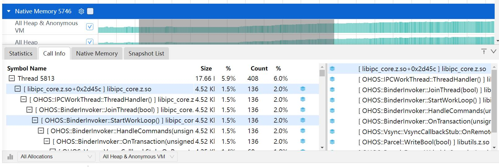
### Native Memory详细显示的过滤功能
点击下方的All Allocations可以对Allocation的lifeSpan进行过滤，有三个选择：All Allocatios，Create & Exsiting，Create & Destroyed。
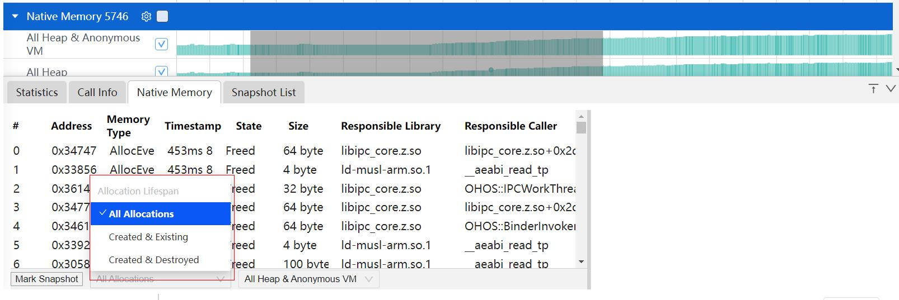
+      All Allocations：所有的内存。
+      Created & Exsiting：创建且被存活的内存。
+      Created & Destroyed： 创建且被销毁的内存。
点击下方的All Heap&Anonymous可以对内存类型进行过滤。
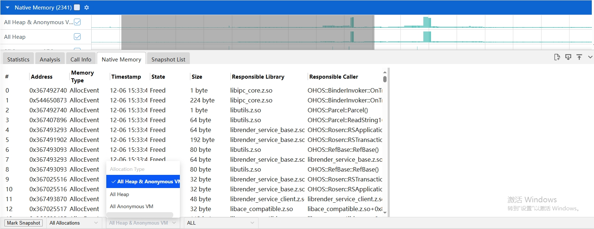
+     All Heap&AnonuymousVM：Heap和AnonuymousVM的总量。
+     All Heap：malloc分配的内存。
+     All Anonymous VM：mmap的匿名页。
点击下方的Mark Snapshot可以在时间轴上打标签。出现小旗的标志，通过标注多个时间点。点击到Snapshot List标签页可以看到各个时间点的内存的增长值。
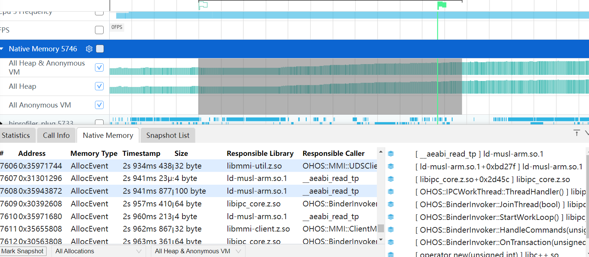
### Native Memory的火焰图功能
火焰图的展示跟Callinfo的tab页的调用栈显示一致，鼠标放到色块上，悬浮框可以显示调用栈名称，栈的所在库名，地址，size大小，栈的个数。
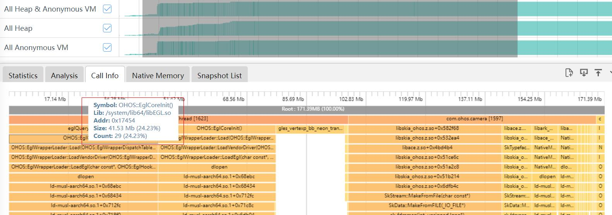
### 基于函数进行调用栈（单个或多个）选择后可以在时间轴上显示内存操作点
点击火焰图函数时，触发火焰图点击中，显示调用栈中该函数出现在时间轴范围的分布情况。
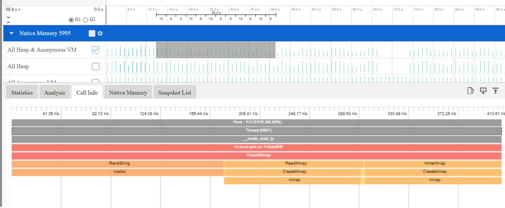
### 内存搜索大小写不敏感，上层火焰图的大小和总内存需要根据搜索内容动态调整
执行搜索的关键字大小写不区分，搜索的函数的parent只显示搜索的children的大小之和，且可以与点选联动。
### 焦点函数火焰图详细展开：选中函数的全部调用栈展示
点击调用栈某个函数，点击函数调用的函数对应铺满画布，点击函数的parent，显示以及绘制的大小变化为点击函数的大小，如下图点击OHOS::EglCoreInit()函数，会显示该函数的全部调用栈。
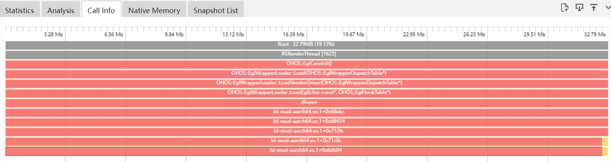
### 调用栈默认显示火焰图，根据Native层分类规则显示颜色，搜索结果高亮
调用栈默认显示火焰图，新增搜索框表达式输入。表达式作用范围为nativehook统计与非统计模式。其中处理的均为Responsible Library与Responsible Caller，其中Responsible Library，Responsible Caller表示从下往上非libc++ musl的第一条调用栈的lib跟symbol，如下图所示，由于最后一条 [ operator new(unsigned long) ] libc++.so为libc++.so的函数，固跳过，所以该条调用栈的Responsible Library为 libhilog.so，Responsible Caller为OHOS::HiviewDFX::GetDomainLevel(unsigned int) 。
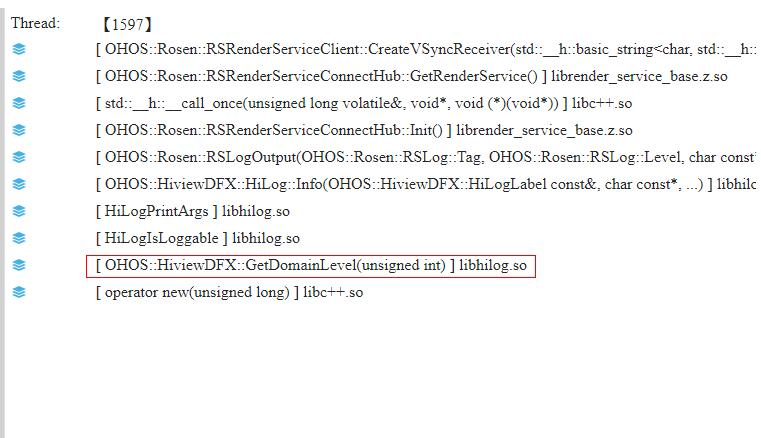
表达式说明:在InputFilter输入框可以进行搜索过滤和表达式过滤，其中表达式必须以@开头，英文括号包起所需要过滤的内容，每个括号必须包括 （Responsible Library，Responsible Caller）匹配全量以*表示，否则认为该输入为搜索过滤。

| 表达式 | 含义 |
| --- | --- |
| @(libquickjs tryalloc) | 只显示 Responsible Library为libquickjs 且Responsible Caller包含tryalloc的数据 |
| @(libquickjs *)  | 只显示Responsible Library包含libquickjs的数据 |
| @(* tryalloc codec bitmapcache skYUV) | 只显示 Responsible Library为任意值 且Responsible Caller包含tryalloc或codec或bitmapcache或skYUV的数据 |
| @(libglobal *，*resourceManager)  | 只显示Responsible Library包含libglobal且 Responsible Caller为任意值的数据 或 Responsible Library为任意值，Responsible Caller包含resourceManager的数据 |
| @(/data/user *)  | 只显示Responsible Library路径/data/user且symbol为任意值的数据 |
| @(mali.so *,libGLES_mali.so *)  | 只显示Responsible Library包含mali.so或者libGLES_mali.so的数据 |
| @(* PixelMap:ReadImageData)  | 只显示Responsible Caller包含PixelMap:ReadImageData的数据 |
|  |  |
| @-(libark jsvm table) | 不显示Responsible Library包含libark且Responsible Caller包含jsvm或者table的数据 |
| @-(librender picture, libskia picture)   | 不显示Responsible Library包含librender或者libskia且Responsible Caller中包含picture的数据 |
| @-(libark *) | 不显示Responsible Library包含libark的数据 |
| @-(* table) | 不显示Responsible Caller中table的数据 |
|  |  |
| @(* table) - (libark *) | 只显示Responsible Caller包含table且Responsible Library不为libark的数据 |
### Native Memory数据统计功能
选择Use Record Statistics和statistics interval配置项抓取的数据，只会显示Call Info的Tab页，Call Info相关功能同上。
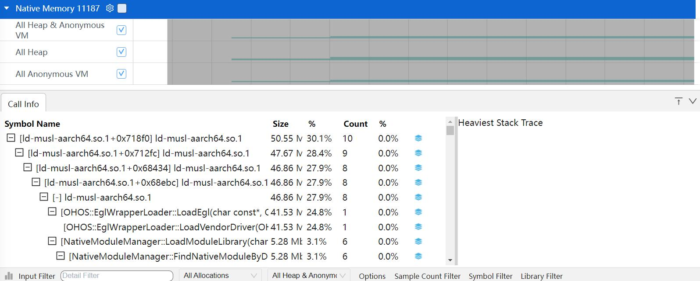

