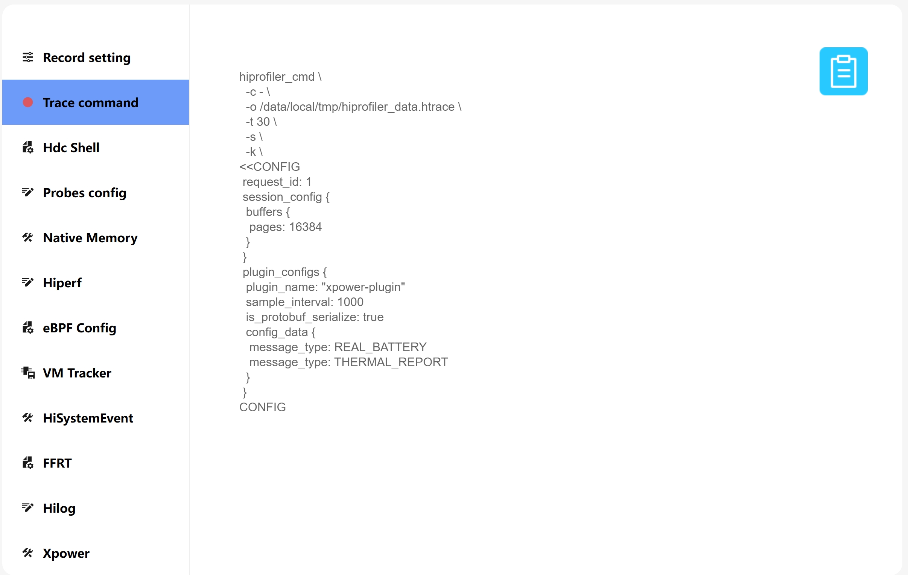
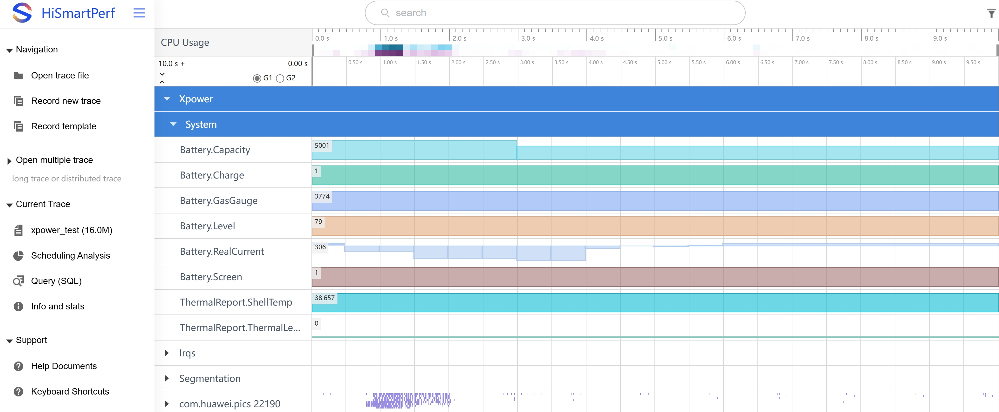
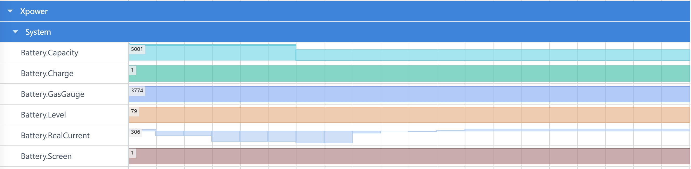
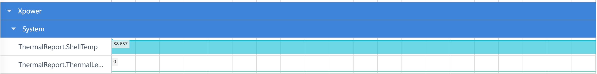

# Xpower 抓取和展示说明

Xpower用于查看系统整机和应用功耗数据，当前支持：电源信息、热温度信息。

## Xpower 的抓取

#### Xpower 的抓取配置参数

打开Start Xpower Record开关抓取Xpower数据。点击MessageType下拉框，可以选择需要抓取的类型(下拉框支持多选)。

配置项说明：

-     REAL_BATTERY：电源信息。
-     THERMAL_REPORT：热温度信息。

选择后Trace command页面显示对应抓取命令

### Xpower 展示说明

将抓取的Xpower文件导入到HiSmartPerf工具中查看，查看系统整机和应用功耗情况。

### Xpower泳道图说明——REAL_BATTERY

选择REAL_BATTERY会展示六条泳道：

-     Battery.Capacity： 电池容量(单位mAh)。
-     Battery.Charge： 充电状态(充电1,非充电0)。
-     Battery.GasGauge：电池剩余电量(单位mAh)。
-     Battery.Level：电池百分比。
-     Battery.RealCurrent： 实时电流(单位mAh,充电时为正数,耗电时为负数)。
-     Battery.Screen： 屏幕状态(亮屏1,灭屏0)。

### Xpower泳道图说明——THERMAL_REPORT
  选择THERMAL_REPORT则展示两条泳道：
  

-     ThermalReport.ShellTemp： 外壳温度(单位℃)。
-     ThermalReport.ThermalLevel： 温度等级。
